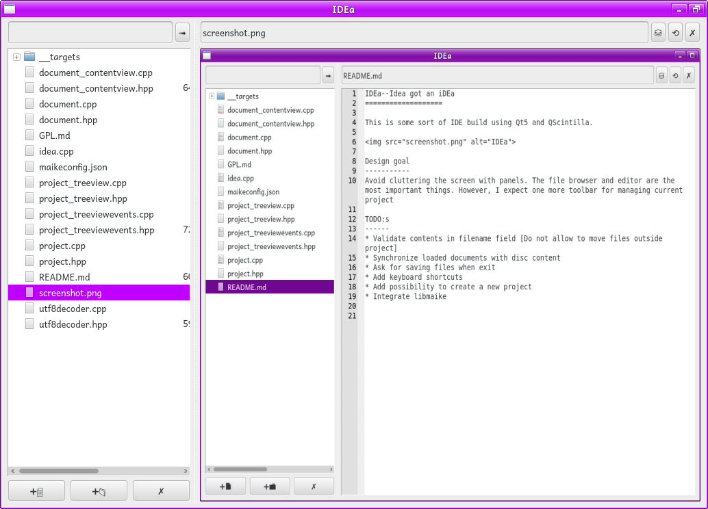

IDEa--Idea got an iDEa
======================

This is some sort of IDE build using Qt5 and QScintilla.

Design goal
-----------
Avoid cluttering the screen with panels. The file browser and editor are the most important things. However, I expect one more toolbar for managing current project

TODO:s
------
* Validate contents in filename field [Do not allow to move files outside project]
* Synchronize loaded documents with disc content
* Ask for saving files when exit
* Add keyboard shortcuts
* Add possibility to create a new project
* Integrate libmaike

